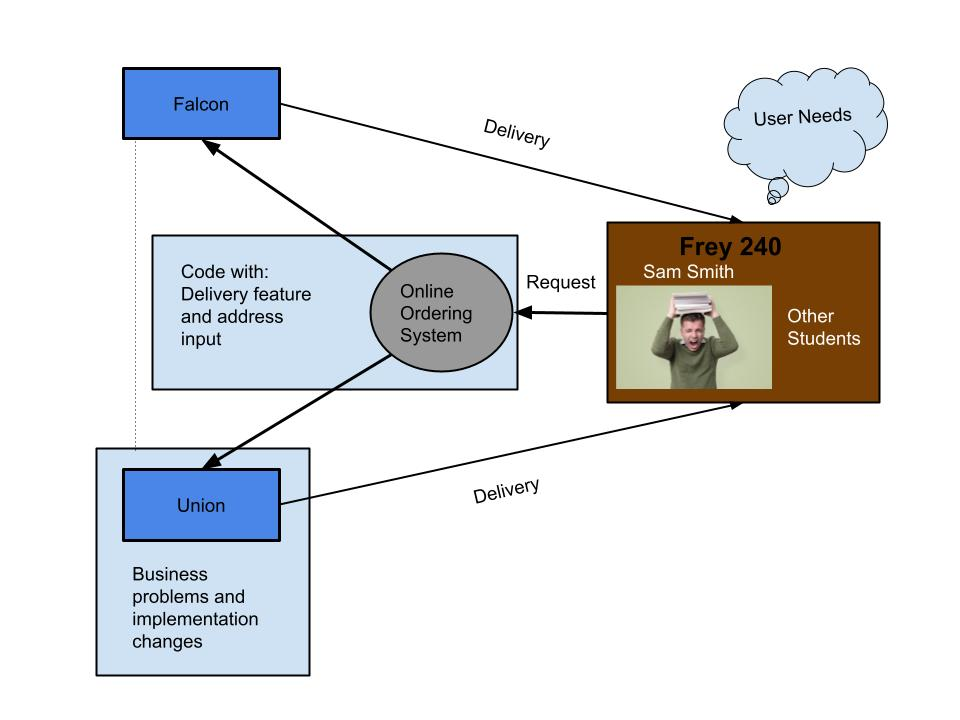
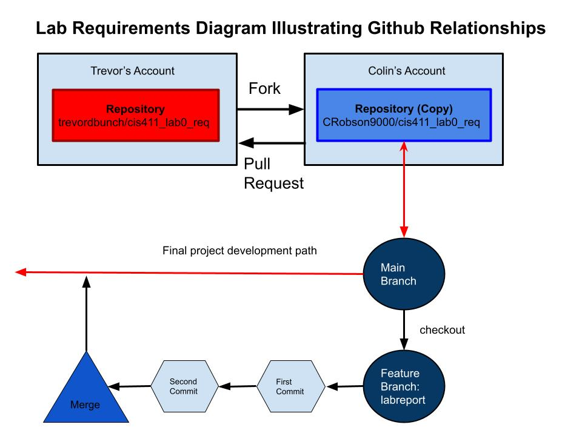

# Lab Report: Requirements
___
**Course:** CIS 411, Spring 2021  
**Instructor(s):** [Trevor Bunch](https://github.com/trevordbunch)  
**Name:** Colin Robson  
**GitHub Handle:** @CRobson9000  
**Repository:** [Lab Requirements](https://github.com/CRobson9000/cis411_lab0_req.git)  
___

## 1. Overview
&nbsp;&nbsp;&nbsp;&nbsp;Sam Smith, a student at Messiah University, was complaining about how his schedule this semester didn't allow time for him to get lunch.  In an annoyed voice he said, “I would like to order a meal from an on-campus provider, and have it delivered to my classroom”.  I've been tasked with critically analyzing this problem to create a system in which Sam can order his lunch from the Union and have it delievered to his classroom so he won't be late and so that he can eat lunch.

&nbsp;&nbsp;&nbsp;&nbsp;I will need to work with the Union and Falcon to solve this problem because they already have ordering systems and are in the business of selling food to Messiah students.  With access to their ordering apps, I'll be able to modify them to include a delivery feature.  I'll need to consult with them about how this idea will effect their busineses, some of these effects being hiring more staff, accounting for more orders which affects supply management, and possible changes in how they implement the ordering system.  I will also need to work with Sam and other students like Sam to determine the modified apps' function.  

### Overview Diagram:  

## 2. Requirements
### Business ###

* B1: The contract must require the Union and Flacon to hire more staff in order to keep up with new delivery orders. (Me, the writer of this document) 
* B2: The manager must train the staff to update an order's status. (Me, the writer of this document)  
&nbsp;&nbsp;&nbsp;&nbsp;Specifically, they must...
    * Update the order status to "Ready" when the staff member is done making the meal.
    * Update the order status to "On the Way" when the staff member is delivering the meal. 
    * Update the order status to "Delivered" when the staff member has delivered the meal (for logging purposes).
* B3: The Union and Falcon must provide delivery insurance so that if anything happens to the food on the way, the user is not charged the amount. (Jeshua Ho, a business adminstration major at Messiah University)
* B4: The delivery service will require the user to pay an extra delivery fee, to help balance the extra costs of paying more workers and lower the incentive to order in this way. (Jeshua Ho, a business adminstration major at Messiah University)
* B5: The Union and Falcon must each provide at least one bike for long distance deliveries to ensure that the food is kept warm and the users are not kept waiting (Josh Mah, engineering major at Messiah University)  

### User ###

* U1: The user must input the building and classroom they would like their food to be delivered to. (Sam Smith, the disgruntled and hungry student) 
* U2: The user must login to their Messiah University account through the university's login system so the system can verify that the person ordering the meal is a Messiah student and so the system can access the student's phone number. (Hank Farkle IT Coordinator)
* U3: The user must place a valid meal order before requesting a delivery. (Jane Doe, the lead manager of the Union Cafe)
* U4: The user must order to a valid classroom or building on Messiah University's campus. (Me, the writer of this document)
* U5: The user must add a description of themselves so the deliverer knows who they are delivering to. (Hannah Carnes student at Messiah University)
* U6: The user must agree to pay before the delivery, allowing the Union or Falcon to take funds directly from their Messiah account (Jane Doe, the lead manager of the Union Cafe)   

### Functional

#### Delivery Feature Added to Ordering Website
* F1: The system must provide a place for the user to input the building and classroom they would like their food to be delivered to. (Me, the writer of this document)

* F2: The system must record the details of the order and delivery in a log so that the Union and Falcon can keep track of all of their deliveries. (Steve Harrington, the lead manager of the Falcon)

* F3: The system must decline deliveries if there are not enough employees "checked in" or too many employees are busy delivering other orders. (Steve Harrington, the lead manager of the Falcon)

* F4: If the user is forced to wait, the system must give an estimated wait time and supply an option to pick it up instead. (Sam Smith, the disgruntled and hungry student) 

* F5: The system must display how many workers are currently available so the user can know whether or not that they should pick it up or get it delivered. (Sam Smith, the disgruntled and hungry student)
  
#### Employee Status
* F6: The system must allow employees to "check in" as people available to make deliveries. (Jane Doe, the lead manager of the Union Cafe)

* F7: The system must allow employees to "check out" when they are done with their shift. (Jane Doe, the lead manager of the Union Cafe)

* F8: The system must allow employees to update their status as "busy". (Jane Doe, the lead manager of the Union Cafe)

#### Order Status and Delivery Details

* F9: The system must provide the user with notifications on the status of their order. (Sam Smith, the disgruntled and hungry student)
  
* F10: The system must notify the user when their order has been prepared. (Me, the writer of this document)
  
* F11: The system must allow a Union or Falcon staff member to update the status of an order.  This includes when the order is done being made, when the order is being delivered, and when it has been delivered. (Me, the writer of this document)
  
* F12: The system must provide the ability for the staff member to send SMS messages to the user in case there were errors in the order or in case their location or description is unclear. (Me, the writer of this document)

### Non-Functional ###

* N1: The styles of the added features must match the styles of the existing features. (Judy Fashion, the UI-UX designer)
  
* N2: The information for the new features of the app must be compatible with an e-reader so that people who are blind can still use the service. (Judy Fashion, the UI-UX designer)
   
* N3: The delivery exchange must comply with the COVID-19 guidelines set by Messiah University. (Kim Phipps, president of Messiah University)
  

### System ###

* S1: The system must utilize the existing databases  associated with the Falcon and Union to record delivery information including location, order, and student information. (Hank Farkle IT Coordinator)
* S2: The system's new features must be coded in way that is cohesive with the existing framework. (Hank Farkle IT Coordinator)
* S3: The system must utilize SMS features to send text message notifications of their order's status. (Hank Farkle IT Coordinator) 
* S4: The current database system must be able to support the weight of all of the new requests coming in and all of the new data that needs to be stored. (Hank Farkle IT Coordinator) 
* S5: The system must support views from desktop and mobile devices. (Hank Farkle IT Coordinator) 

## Appendix: GitHub Notes

### Github Relationship Diagramn (Forked Repository and Branches)

<em>Note: I combined both the diagrams together because I thought that it better illustrated the relationships you were asking for in a big-picture sense. </em>

### A.2 Git Logs

#### 1
* ea25789 : (HEAD -> labreport) Finished overview and diagrams for overview and github relationships
* 5ec88ff : (origin/labreport) first commit @trevordbunch
* 50d40f8 : (origin/main, origin/HEAD, main) Update references to main branch
* ef962b1 : Fix links in resource area
* 237b52e : Update Instructions for template file
dafaf5e : Merge pull request #2 from NedacNostrebor/patch-1
* 6293806 : Merge pull request #1 from mcjo163/main
* 7482f04 : Typo in lab instructions
* 3080719 : typo in readme
* 33efb41 : formatted template
* fd13d03 : initial draft
* ad87871 : Create License
  
#### 2
* 5fc2104 : (HEAD -> labreport) actual final commit with grammatical and spelling errors fixed
* e31b3b3 : final commit and final version of the project
ea25789 : Finished overview and diagrams for overview and github relationships
* 5ec88ff : (origin/labreport) first commit @trevordbunch
* 50d40f8 : (origin/main, origin/HEAD, main) Update references to main branch
* ef962b1 : Fix links in resource area
* 237b52e : Update Instructions for template file
* dafaf5e : Merge pull request #2 from NedacNostrebor/patch-1
* 6293806 : Merge pull request #1 from mcjo163/main
* 7482f04 : Typo in lab instructions
* 3080719 : typo in readme
* 33efb41 : formatted template
* fd13d03 : initial draft

