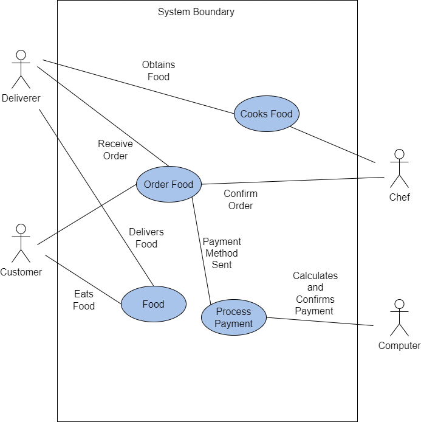

# Lab Report: Requirements
___
**Course:** CIS 411, Spring 2021  
**Instructor(s):** [Trevor Bunch](https://github.com/trevordbunch)  
**Name:** Justin Ayres  
**GitHub Handle:** JDAyres   
**Repository:** https://github.com/JDAyres/cis411_lab0_req 
___

## 1. Overview
The business problem presented is, "I would like to order a meal from an on-campus provider, and have it delivered to my classroom". The problem is a method to deliver food to a student or faculty member from an on-campus provider.

In this section provides a brief overview of the business problem.  By brief, it should include a single image (business process or use case diagram) and a textual explanation (describing actors, tasks, information, or outcomes) and described in *Step 4*.

Application Use Case Diagram:  

Explenation:
The customer orders food which gets proccessed by our system, once this is complete the food order is confirmed by the chef who then cooks the food. The deliverer obtains the food and then deliveres it to the customer who then eats, and enjoys it... ideally.                   

## 2. Requirements
### Business 
B.1 The system must have a tipping feature for the worker, so that the customer can tip the deliverer (Student 4)
### User
U.1 The customer must provide their payment information to confirm the order (Studnet 5)
### Functional
F.1 The stystem must have a customer service review module(Student 2)

### Non-Functional
N.1 The system must have a miles per hour calculator so that the customer can see how fast the deliverer is moving (Student 4)

N.2 The system must have a module that shows the customer who is delivering their food(Studnet 3)
### System
S.1 The system must be a mobile application and accessable from Falconlink(Student 1)

## Appendix: GitHub Notes

### A.1 Forked Repository
Diagram of the relationship between My repository and Trevor Bunch's repository:

### A.2 Git Logs
Logs from 2.7: Creating A Feature Branch

In this section, provide the logs from *Step 2.7* and *Step 6.4*.

Hint: for system output, use markdown's fenced code block for formatting.

### A.3 Branch Repository
Dkiagram of a relationship between a main branch and a feature branch:

### A.4 Extra Credit
In this section, provide the round-trip diagram described in *Step 8*.