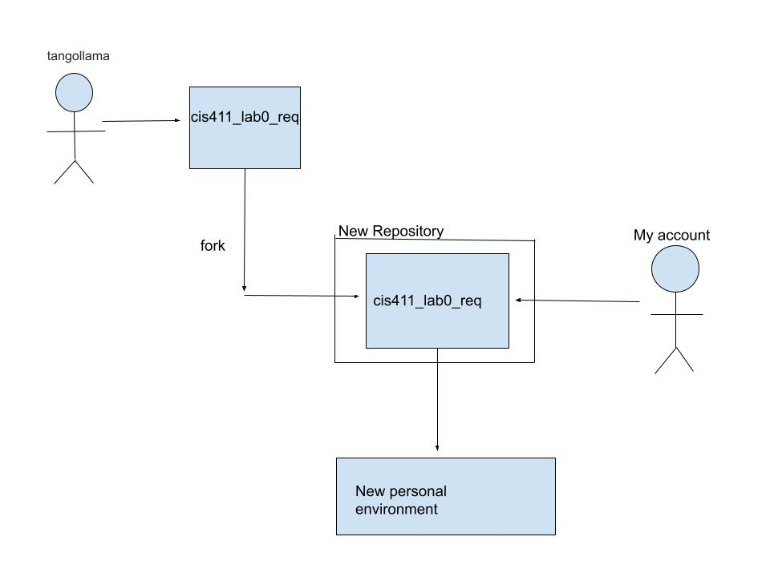
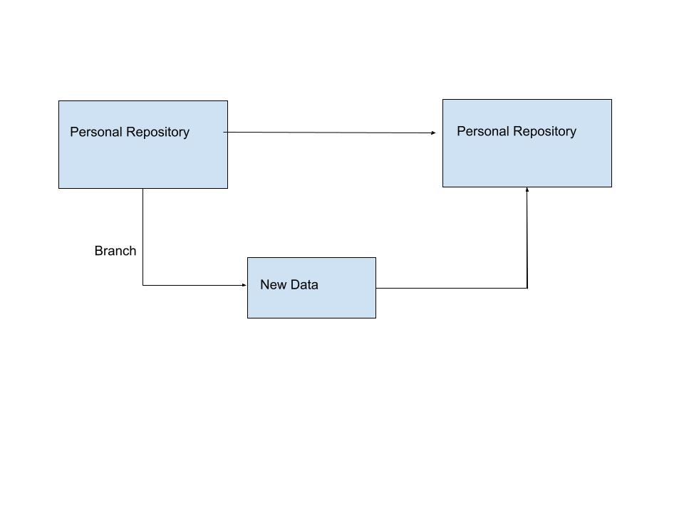

# Lab Report: Requirements
___
**Course:** CIS 411, Spring 2021  
**Instructor(s):** [Trevor Bunch](https://github.com/trevordbunch)  
**Name:** Shane Wahlberg
**GitHub Handle:** CuriousOcean  
**Repository:** Your Forked Repository  
___

## 1. Overview
In this section provides a brief overview of the business problem.  By brief, it should include a single image (business process or use case diagram) and a textual explanation (describing actors, tasks, information, or outcomes) and described in *Step 4*.

Here is an example of including a image into your lab report using a URL:  
  
Credit: By Kishorekumar 62, CC BY-SA 3.0, https://commons.wikimedia.org/w/index.php?curid=7880320

Here is an example of including a image into your lab report using an uploaded file:  
  
Credit: By Kishorekumar 62, CC BY-SA 3.0, https://commons.wikimedia.org/w/index.php?curid=7880320

## 2. Requirements
Upon interviewing faculty and members of the student body, the following list was created. 

1. *Business*: Business objectives that the system needs to satify.
   
    1.  **B1**: System must limit orders based on staff capacity, so that the delivery service level is not placed in jeopardy.
    2.  **B2**: Once food is ordered, charge must be automatically applied to user's account. 
2. *User*: The actions that a user takes within the system.

   1. **U1**: User must associate their account with payment method(FalconDollars, Dining Dollars).
   2. **U2**: User must input where they want the food to be delivered.

       1. **U2.1**: User must indicate if they will be there for the food or not. 

3. *Functional*: Functions the system should perform.

    1. **F1**: System must present an anticipated delivery time prior to allowing the user to confirm the order. 
    2. **F2**: System should allow the user to track the order. 
    3. **F3**: System should be able to determine delivery time before confimration. 

4. *Non-Functional*: Characteristics that the system should have.

    1. **N1**: THe system must render pages in less then 1 second after any user action or application event. 

5. *System*: Specifications about how the system should be built. 

    1. **S1**: System must use Messiah College Single Sign On solution for any accounts with a messiah.edu domian. 

## 3. Assumptions
This is an optional section, where system constraints, out of scope features or other caveats can be clearly documented.  

## Appendix: GitHub Notes

### A.1 Forked Repository
In this section, provide a diagram that demonstrates the relationship between the [source repository](https://github.com/trevordbunch/cis411_lab0_req) and your forked repository in *Step 1.* 

### A.2 Git Logs
In this section, provide the logs from *Step 2.7* and *Step 6.4*.

**Log of Step 2.7**:

    <code> $ git log --oneline
    ad8833f (HEAD -> main, origin/main, origin/HEAD) Updates
    2beab73 Merge branch 'labreport'
    2826824 (origin/labreport, labreport) Update LAB_[CuriousOcean].md
    7882ea2 Add files via upload
    e1f8213 Add files via upload
    874d011 Delete DiagramRelationship2.pdf
    8c0a64a Delete Diagram Relationship 1.pdf
    c6e8996 Update LAB_[CuriousOcean].md
    c31ed10 Add files via upload
    17ad070 your commit and reference @trevordbunch in the message
    a77f7d6 Add files via upload
    50d40f8 (upstream/main, upstream/HEAD) Update references to main branch
    ef962b1 Fix links in resource area
    237b52e Update Instructions for template file
    dafaf5e Merge pull request #2 from NedacNostrebor/patch-1
    6293806 Merge pull request #1 from mcjo163/main
    7482f04 Typo in lab instructions
    3080719 typo in readme
    33efb41 formatted template
    fd13d03 initial draft
    ad87871 Create License
</code>

**Log of Step 6.7**:

    <code>$ git log --oneline
    ad8833f (HEAD -> main, origin/main, origin/HEAD) Updates
    2beab73 Merge branch 'labreport'
    2826824 (origin/labreport, labreport) Update LAB_[CuriousOcean].md
    7882ea2 Add files via upload
    e1f8213 Add files via upload
    874d011 Delete DiagramRelationship2.pdf
    8c0a64a Delete Diagram Relationship 1.pdf
    c6e8996 Update LAB_[CuriousOcean].md
    c31ed10 Add files via upload
    17ad070 your commit and reference @trevordbunch in the message
    a77f7d6 Add files via upload
    50d40f8 (upstream/main, upstream/HEAD) Update references to main branch
    ef962b1 Fix links in resource area
    237b52e Update Instructions for template file
    dafaf5e Merge pull request #2 from NedacNostrebor/patch-1
    6293806 Merge pull request #1 from mcjo163/main
    7482f04 Typo in lab instructions
    3080719 typo in readme
    33efb41 formatted template
    fd13d03 initial draft
    ad87871 Create License

</code>

### A.3 Branch Repository
In this section, provide a diagram that demonstrates the relationship between your main branch and your feature branch in your repository (*Step 2.8*)

### A.4 Extra Credit
In this section, provide the round-trip diagram described in *Step 8*.