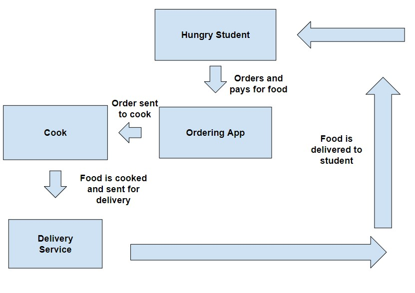
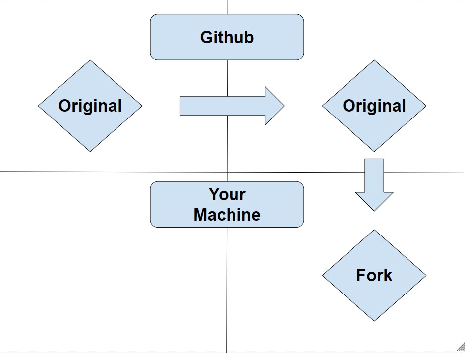
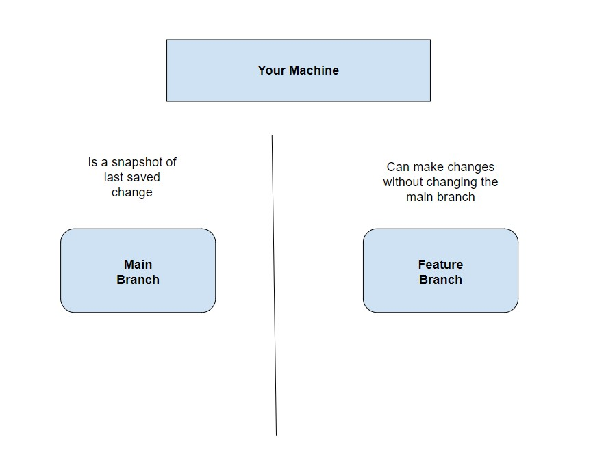

# Lab Report: Requirements
___
**Course:** CIS 411, Spring 2022  
**Instructor(s):** [Trevor Bunch](https://github.com/trevordbunch)  
**Name:** Austin Dorsey  
**GitHub Handle:** Dorsecles  
**Repository:** Dorsecles
/
cis411_lab0_req 
___

## 1. Overview
In this section provides a brief overview of the business problem.  By brief, it should include a single image (business process or use case diagram) and a textual explanation (describing actors, tasks, information, or outcomes) and described in *Step 4*.

  

The students will order food off the ordering app. The app should use Messiah's student authentification software to make sure only students can use this app and to connect it to the student's meal plan. The app will also charge the account. Once the student orders, the cooks should make the food and send it to delivery service on campus. The delivery service should then take the food to the desired location.

## 2. Requirements
In this section, organize and list requirements from *Step 5*.  You are welcome to organize this section in anyway that you would like (using headings or tables).  The structure of this section should correspond to your overview section, and it is recommended that that you review the [lessons learned](../lessonsLearned.md) from your colleagues.

Business-
The app should cater to the user so they will want to use it again. (The head honcho)

User-
The app should allow you to share your phone number so you can recieve a text once they are outside your classes' door so they don't disrupt the classroom. (Conscientious student)

Functional-
The app should have an estimated waiting time so I know if there is enough time for it to get there before my next class. (Busy student)

Non-Functional-
The app should look appealing. (Front end developer)

System- The app should use the Messiah University Single Sign On for accounts using the messiah.edu domain (Policy IT01.02)

## 3. Assumptions
This is an optional section, where system constraints, out of scope features or other caveats can be clearly documented.  

A possible problem with this business practice is that the professor of the classroom may not approve of a delivery service interuppting their class. A way around this problem could be allowing the student to provide their phone number and the delivery people could wait outside the classroom after sending a text.

## Appendix: GitHub Notes

### A.1 Forked Repository
In this section, provide a diagram that demonstrates the relationship between the [source repository](https://github.com/trevordbunch/cis411_lab0_req) and your forked repository in *Step 1.*  

### A.2 Git Logs
In this section, provide the logs from *Step 2.7* and *Step 6.4*.

Hint: for system output, use markdown's fenced code block for formatting.

2.7-
aae98a7 (HEAD -> labreport, origin/labreport) Added feature branch @trevordbunch
50d40f8 (origin/main, origin/HEAD, main) Update references to main branch
ef962b1 Fix links in resource area
237b52e Update Instructions for template file
dafaf5e Merge pull request #2 from NedacNostrebor/patch-1
6293806 Merge pull request #1 from mcjo163/main
7482f04 Typo in lab instructions
3080719 typo in readme
33efb41 formatted template
fd13d03 initial draft
ad87871 Create License

6.4-
Updating 50d40f8..aae98a7
Fast-forward
 labreports/LAB_[Dorsecles].md | 41 +++++++++++++++++++++++++++++++++++++++++
 1 file changed, 41 insertions(+)
 create mode 100644 labreports/LAB_[Dorsecles].md

### A.3 Branch Repository
In this section, provide a diagram that demonstrates the relationship between your main branch and your feature branch in your repository (*Step 2.8*)

### A.4 Extra Credit
In this section, provide the round-trip diagram described in *Step 8*.