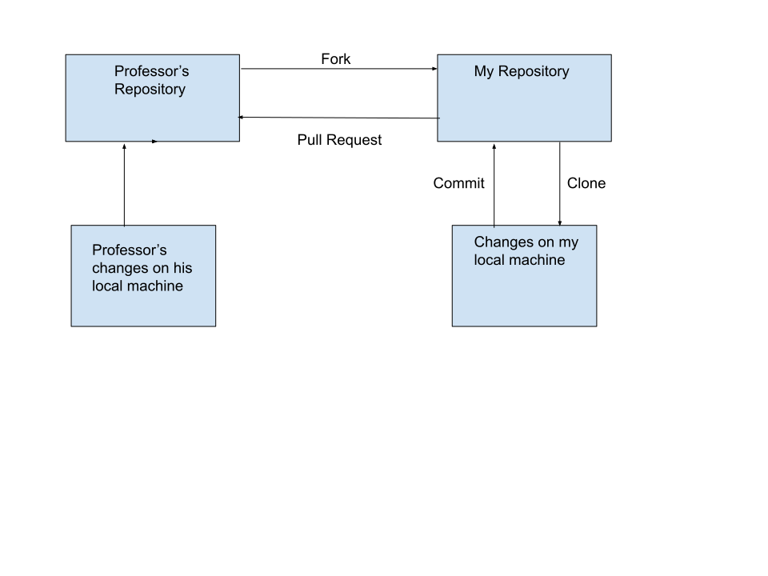

# Lab Report: Requirements
___
**Course:** CIS 411, Spring 2022  
**Instructor(s):** [Trevor Bunch](https://github.com/trevordbunch)  
**Name:** Jamie Padovano  
**GitHub Handle:** JPadovano1483 
**Repository:** https://github.com/JPadovano1483/cis411_lab0_req  
___

## 1. Overview
The problem we are solving is that we would like to be able to order food from an on-campus provider and have it delivered to our classroom. This use case diagram models the relationships between the client, who is ordering and paying for their food, the employees, who both cook and deliver the food, and the boss, who manages the employees. The client orders and pays for their food, then the cook receives the order and cooks the food. Another employee takes the food and delivers it to the client in their classroom. The boss oversees and manages the cooks and other employees.

## 2. Requirements
1. Business
   1.  Must keep and graph data from order times, using it to determine what times are busier for orders and schedule employees accordingly
   2. Must post the afore mentioned data to the page so users can see when the busiest times occur
   3. Must make the cafe a profit of at least 20% (Noel Laven)
2. User
   1. Must have a school email (ending with @messiah.edu)
   2. Must place order, make payment, and specify what building and room to deliver to
   3. Must allow a minimum wait time of 25 minutes
3. Functional
   1. Must inform user of any issues with their order (i.e. out of an item, longer delivery time than expected, issue with payment, etc.)
   2. Must send confirmation email with a receipt, including the items that were purchased, cost (per item and total), and expected delivery time
4. Non-Functional
   1. Page must send order to the cafe within 5 seconds of user hitting submit (Noel Laven)
   2. Should allow user to input any dietary restrictions and refresh the menu options to reflect what they can eat (Justin Wood)
   3. Layout should be easy to follow and use
5. System
   1. Must be available during hours of operation of the cafe
   2. Must only accept orders from users with a school email

## 3. Assumptions
This is an optional section, where system constraints, out of scope features or other caveats can be clearly documented.  

## Appendix: GitHub Notes

### A.1 Forked Repository
This diagram demonstrates the relationship between  the soiurce repository and my forked repository.

### A.2 Git Logs
In this section, provide the logs from *Step 2.7* and *Step 6.4*.

Hint: for system output, use markdown's fenced code block for formatting.

### A.3 Branch Repository
In this section, provide a diagram that demonstrates the relationship between your main branch and your feature branch in your repository (*Step 2.8*)

### A.4 Extra Credit
In this section, provide the round-trip diagram described in *Step 8*.