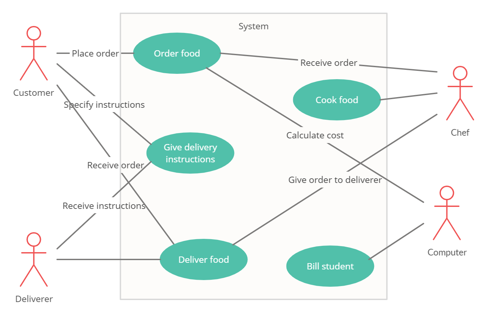

# Lab Report: Requirements
___
**Course:** CIS 411, Spring 2021  
**Instructor(s):** [Trevor Bunch](https://github.com/trevordbunch)  
**Name:** Robbie Dorsey  
**GitHub Handle:** airgo32
**Repository:** https://github.com/airgo32/cis411_lab0_req
___

## 1. Overview
<!-- In this section provides a brief overview of the business problem.  By brief, it should include a single image (business process or use case diagram) and a textual explanation (describing actors, tasks, information, or outcomes) and described in *Step 4*.

Here is an example of including a image into your lab report using a URL:  
  
Credit: By Kishorekumar 62, CC BY-SA 3.0, https://commons.wikimedia.org/w/index.php?curid=7880320

Here is an example of including a image into your lab report using an uploaded file:  
  
Credit: By Kishorekumar 62, CC BY-SA 3.0, https://commons.wikimedia.org/w/index.php?curid=7880320 -->


In this system, a student places an order for an on-campus food provider, but also specifies extra instructions for delivering the order to a specific room in a building on campus. The system then automatically bills the student, just like ordering for pick-up. The prepared order is then given to another employee, who delivers that order to the customer at their specified location.

## 2. Requirements
<!-- In this section, organize and list requirements from *Step 5*.  You are welcome to organize this section in anyway that you would like (using headings or tables).  The structure of this section should correspond to your overview section, and it is recommended that that you review the [lessons learned](../lessonsLearned.md) from your colleagues. -->

### Business

1. The employer must schedule dedicated delivery employees. (Emma)
2. Employees delivering food must follow appropriate COVID-19 safety policies. (Emma)
3. Employees delivering food must not interrupt any active class taking place in the room they are delivering to. (Emma)
4. The system must have a return policy for incorrect or cold orders. (Kyle)
5. The restaurant must have a designated area to store delivery orders away from pick-up orders. (Kyle)
6. Employees delivering food must be certified to operate any equipment they use to deliver orders. (Emma)

### User

1. The user must be able to place their order online through the FalconLink portal. (Kyle)
2. The user must be able to order ahead or specify that they want their delivery as soon as possible. (Kyle)
3. The user must be able to give extra delivery instructions, if necessary. (Emma)
4. The user must be able to communicate directly with the delivery employee. (Emma)
5. The user must verify that a delivery has arrived. (Robbie)

### Functional

1. The system must generate an efficient route for employees delivering multiple orders at once. (Kyle)
2. The system must show the delivery employee employee a picture of the student they'll be delivering to. (Emma)
3. The system must allow the delivery employee to communicate with the customer directly if a problem comes up. (Emma)
4. The system must generate a service fee to add to the order. (Emma)
5. The system must generate a time estimate for deliveries. (Kyle)

### Non-Functional

1. The system must have a menu to specify whether an order is for pick-up or delivery. (Kyle)
2. The system for creating an order must work exactly like placing an order for pick-up. (Kyle)
3. The system must have a menu for specifying a building and room number to deliver to. (Kyle)
4. The order must be delivered in a timely manner, dependent on the location ordered from and the delivery location.  (Emma)


### System

1. The system must use the SSO verification for students placing orders. (Kyle)
2. The system must be able to access the database of student information. (Robbie)
3. The system must be able to access the student's financial information to determine if they can pay for the order. (Kyle)

## 3. Assumptions
<!-- This is an optional section, where system constraints, out of scope features or other caveats can be clearly documented.   -->
These requirements operate under the assumption that on-campus restaurants have enough staff to deliver orders.  
## Appendix: GitHub Notes

### A.1 Forked Repository
In this section, provide a diagram that demonstrates the relationship between the [source repository](https://github.com/trevordbunch/cis411_lab0_req) and your forked repository in *Step 1.*  

### A.2 Git Logs
<!-- In this section, provide the logs from *Step 2.7* and *Step 6.4*. -->
*Step 2.7* git log
```
d878e64 (HEAD -> labreport, origin/labreport) added markdown file for @trevordbunch requirements lab
ef962b1 (origin/main, origin/HEAD, main) Fix links in resource area
237b52e Update Instructions for template file
dafaf5e Merge pull request #2 from NedacNostrebor/patch-1
6293806 Merge pull request #1 from mcjo163/main
7482f04 Typo in lab instructions
3080719 typo in readme
33efb41 formatted template
fd13d03 initial draft
ad87871 Create License
```
<!-- Hint: for system output, use markdown's fenced code block for formatting. -->

### A.3 Branch Repository
<!-- In this section, provide a diagram that demonstrates the relationship between your master/main branch and your feature branch in your repository (*Step 2.8*) -->

### A.4 Extra Credit
In this section, provide the round-trip diagram described in *Step 8*.