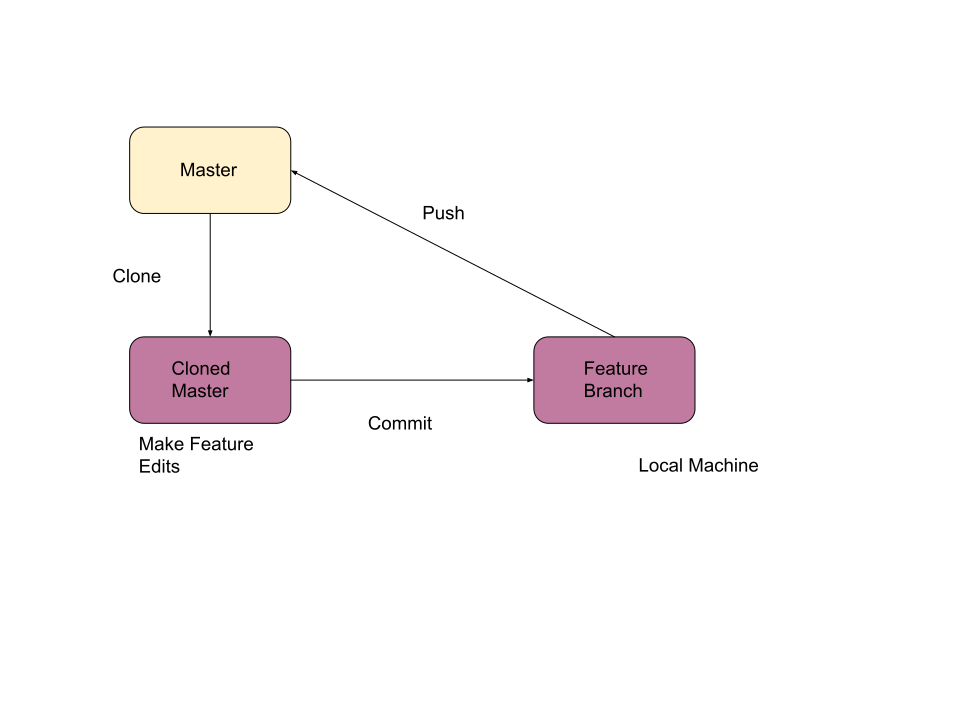

# Lab Report: Requirements
___
**Course:** CIS 411, Spring 2021  
**Instructor(s):** [Trevor Bunch](https://github.com/trevordbunch)  
**Name:** Alec Chappell  
**GitHub Handle:** @alecclyde  
**Repository:** [Alecclyde's Fork](https://github.com/alecclyde/cis411_lab0_req)  
___

## 1. Overview  


## 2. Requirements

Interviewees: Artur Donnelly, Elon Musk, Joe Tonnies, Jeff Bazos

1. Business 
   - 
    B.1 - The website must take the users orders. (Jeff Bazos)  
    B.2 - Give the order to the cooking staff. (Jeff Bazos)  
    B.3 - Give proper information to allow delivery of the food to the customer. (Jeff Bazos)

2. User 
   -  
   U.1 - User must make payments via dining dollars or credit card. (Joe Tonnies)  
   U.2 - Users must either sign-in via a Messiah email or they must manually put in their delivery information. (Joe Tonnies)  
   U.3 - Users must specify time of pickup or delivery. (Joe Tonnies)  
   U.4 - Users must input their menu order through website interface. (Joe Tonnies)
    
3. Functional 
   - 
   F.1 - System must provide user with a way to sign-in with Messiah email. (Joe Tonnies)  
   F.2 - System must provide an interface to order food and select prefrences. (Joe Tonnies)  
   F.3 - System must send a confirmation email to consumer. (Artur Donnelly)   

4. Non-Functional 
   -  
   N.1 - The website must have a clean user interface, it must not be cluttered. (Artur Donnelly)  
   N.2 - The backround of webpage must be customisable. (Artur Donnelly)  
   N.3 - The system must notify customers within 1 minute with order confirmation. (Artur Donnelly)  
   N.4 - System must be able to display live order tracking updates to user. (Artur Donnelly)

5. System 
   - 
   S.1 System must have direct integration with Messiah email server to obtain user data. (Elon Musk)  
   S.2 System must be built using Messiah's servers. (Elon Musk)  
   S.3 The system must be built to accept both Android, IOS, and desktop orders. (Elon Musk)


## Appendix: GitHub Notes

### A.1 Forked Repository  


### A.2 Git Logs  

Output for step 2.7:  
 ```markdowns  
99462c5 Section 2 update  
45c37ac Create LAB_alecclyde.md  
dafaf5e (origin/main, origin/HEAD, main) Merge pull request #2 from NedacNostrebor/patch-1  
6293806 Merge pull request #1 from mcjo163/main  
7482f04 Typo in lab instructions  
3080719 typo in readme  
33efb41 formatted template  
fd13d03 initial draft  
ad87871 Create License  
```
Output for step 6.4   
```markdowns
599c356 (HEAD -> main, origin/labreport, labreport) Added two diagrams
44103af Update labreports\LAB_alecclyde.md
99462c5 Section 2 update
45c37ac Create LAB_alecclyde.md
dafaf5e (origin/main, origin/HEAD) Merge pull request #2 from NedacNostrebor/patch-1
6293806 Merge pull request #1 from mcjo163/main
7482f04 Typo in lab instructions
3080719 typo in readme
33efb41 formatted template
fd13d03 initial draft
ad87871 Create License
```

### A.3 Branch Repository

